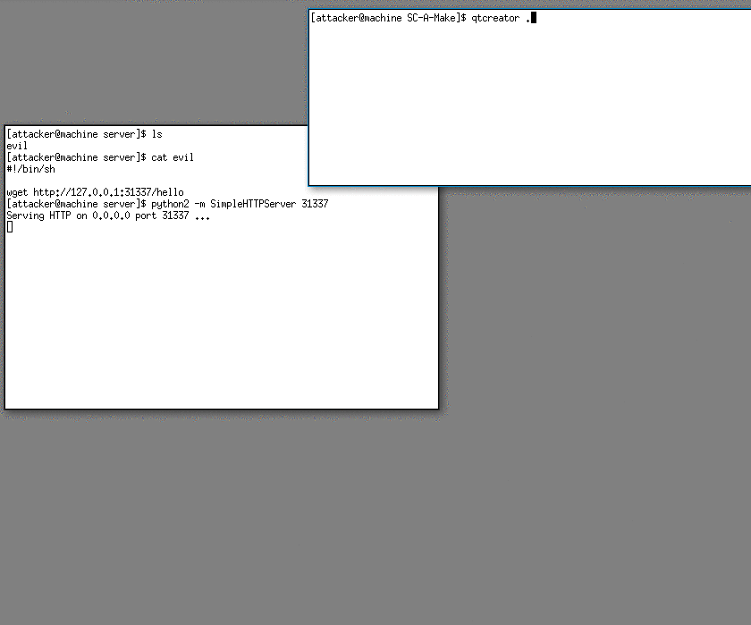

# SC(A)Make

[CMake](https://cmake.org/cmake/help/latest/) has many strong commands including execute_process and file-download (man cmake-commands).
Using those commands is just enough for us to implement a malicious cmake (scam cmake).

## What is so unique about it
Malicious build scripts were always an issue. 
Every Makefile can contain some evil commands which the unsuspecting user may execute on his machine.

The problem with CMake comes from the IDEs supporting it. 
When opening an existing CMake project, IDEs tend to automatically execute the CMakeLists.txt file. Some IDEs affected by this issue are **QTCreator** and **CLion** and I'm sure there are more ...

## PoC
This project is the PoC, just clone it and open it with your favourite CMake supporting IDE.
And from now on, review the makefiles before loading any project.

## Test your IDE
and let me know about more IDEs affected by this issue
